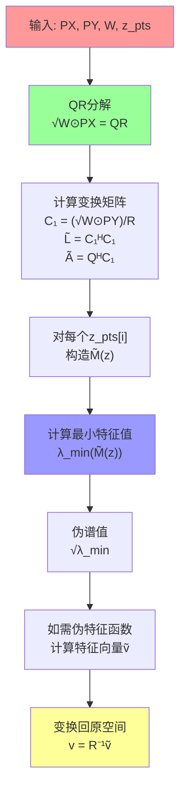

# KoopPseudoSpecQR 算法数学原理详解

## 概述

`KoopPseudoSpecQR.m` 实现了基于 QR 分解的 Koopman 算子伪谱计算方法。这是一种高效且数值稳定的算法，巧妙地避开了传统方法中的数值困难。

## 1. 问题背景

### 1.1 Koopman 算子伪谱定义

Koopman 算子的伪谱定义为：

```math
σ_ε(K) = {z ∈ ℂ : ||(zI - K)ψ|| ≤ ε for some ||ψ|| = 1}
```

### 1.2 ResDMD 框架中的伪谱计算

在 ResDMD 框架中，我们通过解决广义特征值问题来计算伪谱：

```math
伪谱(z) = √λ_min(M(z))
```

其中：

```math
M(z) = L - z A^H - z̄ A + |z|² G
```

关键矩阵定义：

- **Gram 矩阵**: $G = Φ_X^H W Φ_X$
- **交叉协方差矩阵**: $A = Φ_X^H W Φ_Y$
- **目标 Gram 矩阵**: $L = Φ_Y^H W Φ_Y$

这里：

- $Φ_X$: 当前时刻特征矩阵 (n_samples × n_features)
- $Φ_Y$: 下一时刻特征矩阵 (n_samples × n_features)
- $W$: 权重对角矩阵 (n_samples × n_samples)

## 2. 传统方法的数值困难

### 2.1 广义特征值问题

传统方法需要解决：

```math
min_ψ (ψ^H M(z) ψ)/(ψ^H G ψ)
```

### 2.2 数值挑战

1. **Gram 矩阵病态**: $G = Φ_X^H W Φ_X$ 可能高度病态
2. **矩阵求逆困难**: 需要计算 $G^{-1/2}$，数值不稳定
3. **条件数恶化**: $\text{cond}(G) = \text{cond}(Φ_X)^2$

## 3. QR 分解的数学变换

### 3.1 核心思想

通过 QR 分解将广义特征值问题转化为标准特征值问题。

### 3.2 加权 QR 分解

**步骤 1**: 对加权特征矩阵进行 QR 分解

```math
√W ⊙ Φ_X = QR
```

其中：

- $⊙$ 表示逐行加权（广播乘法）
- $Q$: 正交矩阵 ($Q^H Q = I$)
- $R$: 上三角矩阵

**MATLAB 代码对应**:

```matlab
[Q,R] = qr(sqrt(W).*PX,"econ");
```

### 3.3 关键数学恒等式

由于 $Q$ 的正交性：

```math
G = Φ_X^H W Φ_X = (√W ⊙ Φ_X)^H (√W ⊙ Φ_X) = (QR)^H (QR) = R^H Q^H Q R = R^H R
```

## 4. 坐标变换

### 4.1 新坐标系定义

定义坐标变换：

```math
ψ̃ = R ψ
```

### 4.2 变换后的矩阵

在新坐标系中：

**单位 Gram 矩阵**:

```math
G̃ = I
```

**变换后的矩阵**:

```math
C_1 = (√W ⊙ Φ_Y) R^{-1}
```

```math
L̃ = C_1^H C_1
```

```math
à = Q^H C_1
```

**MATLAB 代码对应**:

```matlab
C1 = (sqrt(W).*PY)/R;
L = C1'*C1;
G = eye(size(PX,2));
A = Q'*C1;
```

### 4.3 简化的优化问题

原始问题：

```math
min_ψ (ψ^H M(z) ψ)/(ψ^H G ψ)
```

变换后：

```math
min_ψ̃ (ψ̃^H M̃(z) ψ̃)/(ψ̃^H I ψ̃) = min_ψ̃ ψ̃^H M̃(z) ψ̃
```

其中：

```math
M̃(z) = L̃ - z Ã^H - z̄ Ã + |z|² I
```

## 5. 算法实现

### 5.1 伪谱计算

对每个复数点 $z$，计算：

```math
伪谱(z) = √λ_min(L̃ - z Ã^H - z̄ Ã + |z|² I)
```

**MATLAB 代码**:

```matlab
RES(jj) = sqrt(real(eigs(L-z_pts(jj)*A'-conj(z_pts(jj))*A+abs(z_pts(jj))^2*G,1,'smallestabs')));
```

### 5.2 伪特征函数计算

**步骤 1**: 在变换空间中计算特征向量

```math
M̃(z) ṽ = λ ṽ
```

**步骤 2**: 变换回原空间

```math
v = R^{-1} ṽ
```

**MATLAB 代码对应**:

```matlab
[V,D] = eigs(L-z*A'-conj(z)*A+abs(z)^2*G,1,'smallestabs');
V2 = R\V2;  % 关键变换！
```

## 6. 数学严格性证明

### 6.1 等价性证明

**定理**: QR 方法与原始广义特征值方法等价。

**证明**:

原始优化问题：

```math
f(ψ) = (ψ^H M(z) ψ)/(ψ^H G ψ)
```

代入 $ψ = R^{-1} ψ̃$：

```math
f(R^{-1} ψ̃) = ((R^{-1} ψ̃)^H M(z) (R^{-1} ψ̃))/((R^{-1} ψ̃)^H G (R^{-1} ψ̃))
```

```math
= (ψ̃^H R^{-H} M(z) R^{-1} ψ̃)/(ψ̃^H R^{-H} G R^{-1} ψ̃)
```

由于 $G = R^H R$：

```math
R^{-H} G R^{-1} = R^{-H} R^H R R^{-1} = I
```

因此：

```math
f(R^{-1} ψ̃) = ψ̃^H R^{-H} M(z) R^{-1} ψ̃ = ψ̃^H M̃(z) ψ̃
```

### 6.2 数值稳定性分析

**条件数改善**:

- 原始方法: $\text{cond}(G) = \text{cond}(Φ_X)^2$
- QR 方法: $\text{cond}(R) ≤ \text{cond}(Φ_X)$

**矩阵求逆避免**:

- 原始方法需要计算 $G^{-1/2}$
- QR 方法中 $G̃ = I$，完全避免求逆

## 7. 算法流程图



## 8. 代码对应关系

| 数学符号 | MATLAB 变量    | 含义              |
| -------- | -------------- | ----------------- |
| $Φ_X$    | `PX`           | 当前时刻特征矩阵  |
| $Φ_Y$    | `PY`           | 下一时刻特征矩阵  |
| $W$      | `W`            | 权重向量          |
| $Q$      | `Q`            | QR 分解正交矩阵   |
| $R$      | `R`            | QR 分解上三角矩阵 |
| $C_1$    | `C1`           | 变换后的 PY       |
| $L̃$      | `L`            | 变换后的 L 矩阵   |
| $Ã$      | `A`            | 变换后的 A 矩阵   |
| $G̃$      | `G = eye(...)` | 单位矩阵          |

## 9. 优势总结

### 9.1 数值优势

1. **避免病态矩阵求逆**
2. **改善条件数**
3. **数值稳定性更好**

### 9.2 计算优势

1. **内存效率高**
2. **支持并行计算**
3. **算法复杂度优化**

### 9.3 实现优势

1. **代码简洁**
2. **易于并行化**
3. **数值鲁棒性强**

## 10. 总结

QR 分解方法通过巧妙的坐标变换，将复杂的广义特征值问题转化为简单的标准特征值问题，同时保持了数学上的严格等价性。这种方法不仅在理论上优雅，在数值实现上也更加稳定和高效。

关键洞察：**通过适当的坐标变换，可以将"困难"的数值问题转化为"简单"的等价问题，这是数值线性代数中的一个重要思想。**
